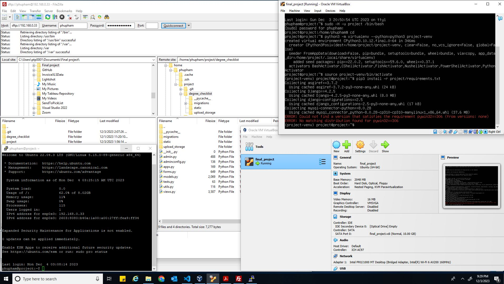

# Web Deployment Process
I followed chapter 17 and 18 in the book. Below is the steps I have taken:

**VirtualBox:**
* Installed VirtualBox, then set up Virtual Machine and Operating System with username (*phupham*) and password (*wtamustudent7*)
* Ubunto Linux installed
* Configured VirtualBox networking and obtained an IP address 192.168.0.33

**PuTTY:**
* Installed PuTTY and set up configuration with the obtained IP address from VirtualBox
* SSH into virtual machine, updated the list of available packages using the command sudo apt update and sudo apt upgrade

**VirutalBox user & database setup, production.conf**
* In VirtualBox, set up PostgreSQL user and database, with the following commands: 
*sudo -u postgre createuser -P project* 
*sudo -u postgres createdb -O project project*
* Created a user as follows: 
    Username: *phupham* 
    Password: *wtamustudent7*
* Also, created a system user with the command: *sudo adduser --disabled-password --shell /bin/false --gecos Project project*
* Created *production.conf*. In there, I configured STATIC_ROOT, MEDIA_ROOT, DJANGO_CONFIGURATION, DJANGO_SECRET_KEY, DJANGO_DATABASE_URL, DJANGO_ALLOWED_HOSTS

**FileZilla:**
* Installed FileZilla, set up with host as "sftp://192.168.0.33", username (phupham), password (wtamustudent7)
* Then I transfered my project folder from my local site to remote site
* Set up python virtual environment and Django, this is where I have trouble continuing. I ran in this error that says *"ERROR: Could not find a version that satisfies the requirement pywin32==306 (from versions: none)"* and *"ERROR: No matching distribution found for pywin32==36"*  

 

**Assignment 2**

Records students, courses, major they enroll in.

**User stories**
* As a student, I want to see what programs are offered at the university.
* As Dacry, I want to know what courses are available and their information at the university.
* As Luisa, I want to review my student information.
-----

**Conceptual Diagram**

* Student and Course has a many to many relationship through Course Enrollment, where a student can take many courses and a course can be taken by many students.
* Each student can select a major to pursue. A major can be selected by many students. This is a many-to-one relationship
* A major is administered by one faculty (College Of). Under one College Of, there can be many majors.
* Also, one College Of can oversee many courses while a course can be associated with jut one College Of. 
-----

**Logical Diagram**

There are 5 tables:
* The Student table stores information about student ID, first name, last name, DOB and their major. 
* Course Enrollment is an intermediate table formed by a many-to-many relationship between Student and Course.
* In the Course Enrollment table, it shows the student ID, course ID, semester and year about each course a student's enrolled in.
* The Course table holds attributes of about each course like its number, name, id and credit hours.
* Major information is stored in the Major table, whereas as Faculty table stores information about their College Of.
-----

**Physical Diagram**

* The Student table connects with the Major table through a foreign key (major_id).
* The Major table connects with the Faculty table through a foreign key (faculty_id). 
* The Course table also connects with the Faculty table through a foreign key (faculty_id).
* The Course Enrollment table connects with Student table and Course table through 2 foreign keys it holds. 
